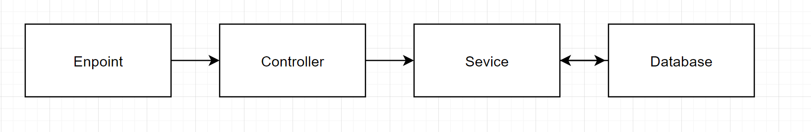

# Hubx-Book-Haven Project

This project is a REST API example built using Node.js, MongoDB, Express.js and TypeScript. The project provides an API for storing and managing book information.

# Environment vars
This project uses the following environment variables:

| Name                          | Description                         | Default Value                                  |
| ----------------------------- | ------------------------------------| -----------------------------------------------|
|MONGO_DB_URI           | MongoDB connection string	            | mongodb://mongodb:27017/hubxCollection      |
|PORT           | The port on which the application runs string	            | 3000      |


## Features

- Add, update, delete and list book operations.
- Using Joi library for data validation.
- Containerization with Docker.

## Installation

Docker and Docker Compose are required to run this project.

1. Clone the project:

```bash
git clone https://github.com/serhatsel1/hubx-book-haven.git
```

2. Install dependencies:

```bash
cd hubx-book-haven
```

3. Go to the project directory:

```bash
npm install
```

4. Start the application with Docker Compose:

```bash
docker-compose up -d
```

This command will build the Docker image and run the application in the background.


## API Documentation

  Navigate to `http://localhost:3000`

- API Document endpoints

  swagger Spec Endpoint : http://localhost:3000/api-docs 

## Data flow



## Project Structure
The folder structure of this app is explained below:

| Name | Description |
| ------------------------ | --------------------------------------------------------------------------------------------- |
| **dist**                 | Contains the distributable (or output) from your TypeScript build.  |
| **node_modules**         | Contains all  npm dependencies                                                            |
| **src**                  | Contains  source code that will be compiled to the dist dir                               |
| **src/controllers**      | Controllers define functions to serve various express routes. 
| **src/db**              | This folder contains common libraries to be used across your application, specifically for database interaction.  
| **src/utils**      | This folder contains utility functions and helpers that are used throughout the application.
| **src/routes**           | Contain all express routes, separated by module/area of application                       
| **src/models**           | Models define schemas that will be used in storing and retrieving data from Application database  |
| **src/errors**      | This folder contains modules related to error handling in the application. |
| **src/schemas**      | This folder contains schemas for validating data using the Joi library. |
| **src/services**      | This folder contains the core business logic for managing books. It interacts with the database models and schemas to perform CRUD operations and other book-related tasks. |
| **src/tests**      | This folder contains unit and integration tests for the application. |
| **src/types**      | This folder contains TypeScript type definitions used throughout the application. |
| **src/index.ts**         | Entry point to express app                                                               |
| **package.json**             | Contains npm dependencies as well as [build scripts](#what-if-a-library-isnt-on-definitelytyped)   | tsconfig.json            | Config settings for compiling source code only written in TypeScript    
## Building the project
### Configuring TypeScript compilation
```json
{
    "compilerOptions": {
    "target": "es2016", 
    "module":"NodeNext",     
    "rootDir": "./src",
    "moduleResolution": "NodeNext",
    "resolveJsonModule": true,
    "outDir": "./dist",
    "esModuleInterop": true,
    "forceConsistentCasingInFileNames": true, 
    "strict": true,
    "skipLibCheck": true  
    },
  }

``` 
## Testing
This project uses Jest as its testing framework. Jest is a JavaScript testing framework that provides a comprehensive and easy-to-use solution for testing JavaScript code, including TypeScript.

```
"@types/jest": "^29.5.13",
"babel-jest": "^29.7.0",
"jest": "^29.7.0"

```

### Example application.spec.ts
```typescript
import { describe, expect, test } from '@jest/globals';
import { Types } from 'mongoose';

describe('Book API', () => {
  describe('GET /books', () => {
    test('should return a list of books', async () => {
      // ... test logic
    });
  });

  // ... other test suites
});
```

**Swagger UI**

The API documentation is available through Swagger UI, which is a web-based interface that allows you to visualize and interact with the API's resources. You can access the Swagger UI at http://localhost:3000/api-docs.

**Swagger Integration**

The Swagger integration is set up using the following libraries:

*   `swagger-jsdoc`: This library generates the Swagger specification (swagger.json) from JSDoc comments in your code.
*   `swagger-ui-express`: This library serves the Swagger UI and allows you to interact with the API through the UI.

**Example JSDoc Comments:**

```typescript
/**
 * @swagger
 * /books:
 *   get:
 *     summary: Get all books
 *     description: Returns a list of all books.
 *     responses:
 *       200:
 *         description: A list of books.
 *         content:
 *           application/json:
 *             schema:
 *               type: array
 *               items:
 *                 $ref: '#/components/schemas/Book'   

 */
```
## Technologies
* Node.js
* MongoDB
* Express.js
* TypeScript
* Joi
* Docker
* Docker Compose
